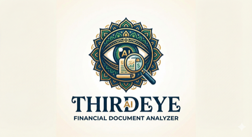

<p align="center">
  
</p>

# ThirdEye AI — User Guide

> A complete guide to using ThirdEye AI for bank statement analysis, with feature explanations and insights into what makes it superior.

---

## Table of Contents

- [Getting Started](#getting-started)
- [Uploading Documents](#uploading-documents)
- [Understanding the Analysis Pipeline](#understanding-the-analysis-pipeline)
- [Agent 1: Extraction Agent](#agent-1-extraction-agent-)
- [Agent 2: Insights Agent](#agent-2-insights-agent-)
- [Agent 3: Tampering Agent](#agent-3-tampering-agent-)
- [Agent 4: Fraud Agent](#agent-4-fraud-agent-)
- [Document Overview Page](#document-overview-page)
- [Managing Documents](#managing-documents)
- [Tips for Best Results](#tips-for-best-results)
- [Why ThirdEye is Superior](#why-thirdeye-is-superior)

---

## Getting Started

1. Open **http://localhost:3000** in your browser
2. You'll see the ThirdEye home page with the upload zone and your document list
3. Upload one or more PDF bank statements
4. Analysis starts **automatically** — no extra clicks needed
5. Results appear within 30–90 seconds per document

---

## Uploading Documents

### How to Upload

- **Drag & drop** PDF files directly onto the upload zone
- **Click** the upload zone to browse and select files
- **Multiple files** can be uploaded simultaneously

### What Happens After Upload

1. Files are validated (must be `.pdf`, max 50MB each)
2. Each PDF is stored and a document record is created
3. **Analysis triggers automatically** — all 4 AI agents begin processing
4. The document status changes: `Uploaded` → `Processing` → `Completed`
5. The page polls every 3 seconds, so you'll see the status update live

### Supported Banks

ThirdEye is optimized for **Singapore bank statements** but works with most bank PDF formats:

| Bank | Format | Extraction Method |
|------|--------|-------------------|
| DBS / POSB | Bordered tables | Table extraction (highest accuracy) |
| Standard Chartered | Bordered tables | Table extraction |
| OCBC | Borderless | Word-position extraction |
| UOB | Borderless | Word-position extraction |
| Aspire | Borderless | Word-position extraction |
| ANEXT / Airwallex | Borderless, multi-currency | Word-position extraction |
| HSBC | Variable | Auto-detected |
| Citibank | Variable | Auto-detected |
| Maybank | Variable | Auto-detected |
| Revolut / Wise | Variable | Auto-detected |
| Others | Any PDF | LLM-powered extraction (fallback) |

---

## Understanding the Analysis Pipeline

When you upload a document, ThirdEye runs **4 specialized AI agents** in sequence:

```
📄 Your PDF
   │
   ▼
🔵 Extraction Agent ──→ Extracts transactions, balances, account info
   │
   ▼
🟡 Tampering Agent ───→ Checks PDF integrity and manipulation signs
   │
   ▼
🔴 Fraud Agent ───────→ Detects anomalies and suspicious patterns
   │
   ▼
🟣 Insights Agent ────→ Generates financial analytics and narrative
   │
   ▼
✅ Results Ready
```

Each agent works independently but benefits from data extracted by previous agents. The entire pipeline typically completes in **30–90 seconds** per document.

---

## Agent 1: Extraction Agent 🔵

### What It Does

The Extraction Agent converts your raw PDF bank statement into structured, machine-readable data. This is the foundation that all other agents build upon.

### Key Capabilities

#### Intelligent Bank Detection
- Uses **GPT-4o Vision** to identify the bank from the logo on page 1
- Falls back to text-based detection (product names, bank identifiers)
- Automatically selects the optimal extraction strategy for each bank

#### Three-Tier Extraction (Zero LLM When Possible)
Most competing products send every page to an LLM for extraction, which is **slow, expensive, and error-prone**. ThirdEye uses a smarter approach:

1. **Table Extraction** — For PDFs with bordered tables (DBS, Standard Chartered), it reads cells directly from the PDF structure. No AI needed.
2. **Word-Position Extraction** — For borderless PDFs (OCBC, Aspire), it auto-discovers column positions from headers and maps each word to the correct column. No AI needed.
3. **LLM Parsing** — Only used as a last resort for unusual formats or scanned PDFs.

> **Result:** Most statements are extracted with **zero LLM calls** for transaction data, making it faster and more accurate than LLM-only solutions.

#### Multi-Currency Support
For statements with multiple currency sections (common in ANEXT/Airwallex):
- Automatically detects currency section boundaries (SGD, USD, EUR, etc.)
- Validates balance chains independently per currency
- Tags each transaction with its currency code

### What You See on the Extraction Page

| Section | Description |
|---------|-------------|
| **Accuracy Score** | Overall extraction accuracy (0–100%) with letter grade (A+ to F) |
| **Summary Cards** | Transaction count, total credits, total debits |
| **Accuracy Breakdown** | Balance chain continuity, opening/closing balance detection, accounting equation check |
| **Balance Chart** | Line chart showing the running balance over time |
| **Transaction Table** | Complete list of extracted transactions with date, description, amount, balance, category, and channel |

### Understanding Accuracy: How Every Metric Is Derived

The **Accuracy Score** is not a vague AI confidence number — it's a deterministic, **weighted composite of 5 mathematical checks** against the extracted data. Here's exactly what each component means and how it's computed:

#### 1. Balance Chain Continuity (40% of score)

**What it is:** A "balance chain" is the mathematical sequence formed by consecutive running balances in a bank statement. For every transaction, the following must hold true:

```
Previous Balance + Credit Amount − Debit Amount = Current Balance
```

**Example:**
| # | Description | Debit | Credit | Balance |
|---|-------------|------:|-------:|--------:|
| 1 | Opening Balance | — | — | $10,000 |
| 2 | Salary Credit | — | $5,000 | $15,000 |
| 3 | Rent Payment | $2,000 | — | $13,000 |
| 4 | Grocery | $150 | — | $12,850 |

Here, every row follows the rule: $10,000 + $5,000 = $15,000 ✓, $15,000 − $2,000 = $13,000 ✓, $13,000 − $150 = $12,850 ✓. That's a **100% valid balance chain**.

**How it's computed:** ThirdEye walks through every consecutive pair of transactions. For each pair, it checks whether `previous_balance ± amount = current_balance` (within a small rounding tolerance). The score is:

```
Balance Chain Score = (valid_links ÷ total_links) × 100
```

**Why 40% weight:** This is the single strongest indicator of extraction quality. If the balance chain is broken, it means transactions were missed, amounts were misread, or rows were duplicated. A broken chain directly undermines the reliability of all downstream analysis.

**For multi-currency statements** (e.g., ANEXT with SGD + USD sections), the balance chain is validated **independently per currency section**, because each currency has its own running balance.

#### 2. Opening & Closing Balance Detection (20% of score)

**What it is:** Every bank statement begins with a "Balance Brought Forward" (B/F) and ends with a "Balance Carried Forward" (C/F). These are anchor points that validate the entire statement.

**How it's computed:**
- ThirdEye searches for rows containing keywords like "BALANCE B/F", "OPENING BALANCE", "BROUGHT FORWARD" (and their variations) for the opening balance
- Similarly searches for "BALANCE C/F", "CLOSING BALANCE", "CARRIED FORWARD" for the closing balance
- Score = 100 if both found, 50 if only one found, 0 if neither found

**Why it matters:** Without these anchor points, there's no way to verify the statement is complete. A statement missing B/F or C/F may be truncated or partially extracted.

#### 3. Accounting Equation Check (20% of score)

**What it is:** This verifies the fundamental accounting identity of the entire statement:

```
Opening Balance + Total Credits − Total Debits = Closing Balance
```

**How it's computed:** ThirdEye sums all extracted credit amounts and all debit amounts, then checks:

```
|  (Opening + Credits − Debits) − Closing  |  ≤  tolerance
```

If the difference is within a small tolerance (to account for rounding), the check passes (score = 100). If it's off by a small amount, a partial score is given. If wildly off, score = 0.

**Why it matters:** Even if the balance chain is valid link-by-link, the accounting equation checks the **global totals**. A statement where individual links pass but the equation fails suggests systematic errors (e.g., a transaction type consistently misclassified as credit instead of debit).

#### 4. Missing Amount Ratio (10% of score)

**What it is:** The percentage of extracted transactions that have a valid, non-null amount.

```
Missing Amount Score = (transactions_with_amount ÷ total_transactions) × 100
```

**Why it matters:** If the extraction engine couldn't parse the amount for a transaction, that row is essentially useless. A high missing-amount rate indicates a parsing failure — the PDF format wasn't well understood.

#### 5. Null Balance Ratio (10% of score)

**What it is:** The percentage of extracted transactions that have a valid running balance value.

```
Null Balance Score = (transactions_with_balance ÷ total_transactions) × 100
```

**Why it matters:** Running balances are essential for the balance chain check (component #1). If many transactions have null balances, the chain validation becomes unreliable, and the balance chart will have gaps.

#### Final Accuracy Score

```
Accuracy = (Balance Chain × 0.40)
         + (Opening/Closing × 0.20)
         + (Accounting Equation × 0.20)
         + (Missing Amount × 0.10)
         + (Null Balance × 0.10)
```

**Grades:** A+ (≥95%) · A (≥90%) · B (≥80%) · C (≥70%) · D (≥50%) · F (<50%)

> **Example:** A statement with 98% valid balance chain, both B/F and C/F found, equation matches, 2 transactions missing amounts out of 200, and 0 null balances would score:
> `(98 × 0.40) + (100 × 0.20) + (100 × 0.20) + (99 × 0.10) + (100 × 0.10)` = **99.1% → A+**

### Other Extraction Metrics

| Metric | How It's Derived |
|--------|------------------|
| **Transaction Count** | Total number of extracted transaction rows (excluding B/F and C/F lines) |
| **Total Credits** | Sum of all positive (credit/deposit) transaction amounts |
| **Total Debits** | Sum of all negative (debit/withdrawal) transaction amounts |
| **Category** | Each transaction is auto-categorized using keyword matching against 15 categories (e.g., "GRAB" → Transport, "SALARY" → Salary & Payroll, "DBS INTERNET BANKING" → Fund Transfers) |
| **Channel** | Payment method detected from description keywords ("FAST", "GIRO", "ATM", "PAYNOW", "NETS", "CHEQUE", etc.) |
| **Counterparty** | The other party in the transaction, extracted from the description text after removing bank-specific prefixes |

---

## Agent 2: Insights Agent 🟣

### What It Does

The Insights Agent transforms raw transaction data into actionable business intelligence. It computes analytics, identifies patterns, and generates an AI-written narrative report.

### Key Capabilities

#### Cash Flow Analysis
- **Total inflow vs. outflow** with net flow calculation
- **Weekly breakdown** showing cash flow trends over time
- **Burn rate** estimation for expense planning
- **Peak transaction days** identification

#### Spending Category Breakdown
Transactions are auto-categorized into **15 categories**:

| Category | Examples |
|----------|---------|
| Salary & Payroll | Monthly salary credits, CPF |
| Business Revenue | Customer payments, invoices |
| Fund Transfers | Internal transfers, standing orders |
| Supplier Payments | Vendor payments, B2B |
| Food & Beverage | Restaurant, food delivery |
| Rent & Lease | Office rent, equipment leases |
| Tax & Government | IRAS, GST, levies |
| Fees & Charges | Bank fees, service charges |
| Loan Payments | Mortgage, credit line |
| Utilities | Electricity, water, internet |
| Transport | Grab, taxi, fuel |
| Insurance | Premiums, coverage |
| Purchases | Equipment, supplies |
| Refunds | Returns, reversals |
| Other | Uncategorized transactions |

The top categories are displayed as a **donut chart with legend**, showing distribution percentages.

#### Top Counterparties
- **Top Senders** — who sends you the most money (by total amount)
- **Top Recipients** — who you pay the most (by total amount)
- **Recurring vendors** — entities appearing 3+ times

#### Unusual Transaction Detection
Automatically flags 4 types of unusual activity, each with a **detailed explanation** of why the transaction was flagged:
- 🔴 **Large transactions** — amounts exceeding 3× the average, with context on the multiplier and what such outliers may indicate (bulk payments, capital expenditures, unauthorized withdrawals)
- 🟡 **Round-number transactions** — exact thousands ≥$1,000 (potential structuring or manual transfers), with explanation of why round amounts warrant review
- 🟠 **Same-day large movements** — both large in and out on the same day, with explanation of pass-through activity or layering risks
- ⚠️ **Low balance events** — balance dropping below $10,000, with explanation of cash flow stress and overdraft implications

#### Transaction Activity by Day of Month
Bar chart showing transaction volume by day (1–31), revealing:
- Which days are busiest (e.g., salary day, rent day)
- Which days are quiet
- Whether activity is evenly distributed or concentrated

#### Channel Analysis
Breakdown of how transactions are processed:
- FAST, GIRO, ATM, PayNow, NETS, Cheque, Debit Purchase, etc.
- Helps understand digital vs. physical banking behavior

#### Business Health Score (0–100)

The Health Score is a **composite metric** that gives a single-number assessment of the business's financial wellbeing based on the extracted transactions. It is computed from **7 indicators**, each scored 0–100 and then averaged:

| # | Indicator | Formula | What a High Score Means |
|---|-----------|---------|------------------------|
| 1 | **Cash Runway** | `closing_balance ÷ average_monthly_outflow` | More months of cash reserves → higher score. ≥6 months = 100, 0 months = 0 |
| 2 | **Revenue Coverage Ratio** | `total_credits ÷ total_debits` | Income comfortably covers expenses. Ratio ≥1.2 = 100, <0.5 = 0 |
| 3 | **Balance Change Trend** | `(closing_balance − opening_balance) ÷ opening_balance × 100` | Balance is growing over the statement period |
| 4 | **Cash Deposit Ratio** | `1.0 − (cash_deposits ÷ total_deposits)` | Low reliance on cash deposits (cash is harder to verify) |
| 5 | **Fee Burden** | `1.0 − (total_fees ÷ total_debits)` | Low proportion of expenses going to bank fees |
| 6 | **Transaction Velocity** | Based on transactions per day compared to expected range | Healthy, consistent transaction activity |
| 7 | **Min Balance Cover** | `min_balance ÷ average_daily_outflow` | Even at the lowest point, the account could cover N days of expenses. ≥30 days = 100 |

**Final Health Score** = average of all 7 indicator scores

**Health Grade:**
- ≥80 → Excellent (green)
- ≥60 → Good (light green)
- ≥40 → Fair (amber)
- <40 → Poor (red)

> **Example:** A business with $500K closing balance, $80K/month outflow, ratio of 1.3 income-to-expenses, growing balance, 5% cash deposits, 1% fee burden, steady daily transactions, and minimum balance covering 45 days would score in the **85–95 range** (Excellent).

#### How Unusual Transactions Are Detected

| Flag | Detection Logic | Threshold |
|------|----------------|-----------|
| **Large transactions** | Compares each transaction amount to the mean of all amounts | Amount > mean × 3 |
| **Round-number transactions** | Checks if amount is exactly divisible by $1,000 | Amount ≥ $1,000 and amount % 1000 = 0 |
| **Same-day large movements** | Finds days where both a credit > $5,000 AND a debit > $5,000 occurred | Both in and out > $5,000 on same day |
| **Low balance events** | Checks the running balance after each transaction | Balance drops below $10,000 |

#### How Category Breakdown Is Computed

Each transaction is matched against a **keyword dictionary** mapping description patterns to 15 categories. For example:
- Description contains "SALARY" or "CPF" → `salary_payroll`
- Description contains "GRAB" or "TAXI" → `transport`
- Description contains "DBS INTERNET BANKING" or "FAST" → `transfer`

The donut chart shows the **top 5 categories by total amount** (debit and credit merged), with all remaining categories grouped into "Other". This prevents chart overcrowding.

#### How Cash Flow Metrics Are Derived

| Metric | Formula |
|--------|--------|
| **Total Inflow** | Sum of all credit transaction amounts |
| **Total Outflow** | Sum of all debit transaction amounts (absolute value) |
| **Net Flow** | Total Inflow − Total Outflow (positive = net gain, negative = net loss) |
| **Weekly Breakdown** | Transactions grouped by week number → sum of credits and debits per week |
| **Burn Rate** | Average weekly outflow × 4.33 (weeks per month) |

#### AI Narrative Report
All the computed data above is sent to GPT-4o, which generates a structured written analysis with 6 sections:
1. **Executive Summary** — High-level overview of financial health
2. **Spending Analysis** — Where the money goes, top categories, notable expenses
3. **Income Analysis** — Revenue sources, consistency, growth trends
4. **Cash Flow Assessment** — Liquidity position, inflow/outflow balance, runway
5. **Risk Observations** — Potential concerns flagged by the data
6. **Recommendations** — Actionable suggestions based on the patterns found

The narrative is generated from the actual computed numbers, not hallucinated — the LLM is given the full dataset and asked to interpret it.

---

## Agent 3: Tampering Agent 🟡

### What It Does

The Tampering Agent examines the **PDF file itself** (not the transactions) for signs of manipulation, editing, or forgery. This is critical for loan applications, KYC, and due diligence.

### The 8 Integrity Checks — How Each Works

#### Check 1: Metadata Date Check
**What it examines:** Every PDF file has embedded metadata including a `CreationDate` and `ModDate` (modification date). A legitimate bank-generated PDF is created once and never modified.

**How it's derived:**
- Extracts both timestamps from the PDF metadata
- Computes the difference: `ModDate − CreationDate`
- **Pass:** Difference ≤ 60 seconds (normal for PDF generation)
- **Fail:** Difference > 60 seconds (suggests the file was opened and edited after original creation) OR `ModDate` is *before* `CreationDate` (timestamp manipulation)

**Why it matters:** If someone downloads a bank statement and edits it in a PDF editor, the modification date changes. This is one of the most reliable tampering indicators.

#### Check 2: Creator/Producer Check
**What it examines:** The PDF `Creator` and `Producer` metadata fields identify the software that generated the file.

**How it's derived:**
- Extracts `Creator` and `Producer` strings from PDF metadata
- Matches against a blacklist of known editing tools:
  - **PDF editors:** Canva, iLovePDF, Smallpdf, Sejda, PDFfiller, Foxit, Nitro, PDF-XChange
  - **Office suites:** LibreOffice, OpenOffice, WPS Office
  - **Print-to-PDF:** Chrome, Firefox (suggests the statement was re-rendered)
  - **Image editors:** Adobe Photoshop, GIMP
- **Pass:** Creator/Producer matches expected bank software or standard generators
- **Fail:** Any blacklisted editor detected

**Why it matters:** A statement originally generated by "DBS Bank PDF Generator" that now shows "Producer: ilovepdf.com" has clearly been modified.

#### Check 3: Metadata Keyword Check
**What it examines:** The PDF Keywords metadata field.

**How it's derived:**
- Extracts the `Keywords` field
- Checks for long hexadecimal strings (>20 characters of hex) which indicate tracking identifiers injected by editing tools
- **Pass:** No suspicious keywords
- **Fail:** Hex tracking strings detected

#### Check 4: Font Consistency
**What it examines:** The fonts embedded in the PDF across all pages.

**How it's derived:**
- Extracts the complete font list from every page using PyMuPDF
- Checks for known editing-tool fonts (e.g., fonts that Canva or Sejda inject)
- Compares fonts page-by-page: counts how many font names differ between consecutive pages
- **Pass:** Consistent fonts throughout, no editing-tool fonts
- **Warning:** >3 font differences between pages (some legitimate variation possible)
- **Fail:** Known editing-tool font detected (strong tampering indicator)

**Why it matters:** When someone edits text in a PDF, the editing tool often uses a different font (or a substitute font) that doesn't match the original bank fonts. Page-to-page variation suggests selective editing on specific pages.

#### Check 5: Page Dimensions
**What it examines:** The physical dimensions of each page when rendered at 300 DPI.

**How it's derived:**
- Renders each page as an image at 300 DPI
- Checks that every page meets minimum dimensions: **1000 × 800 pixels**
- **Pass:** All pages meet minimum size
- **Fail:** Any page is undersized

**Why it matters:** Undersized pages may indicate that someone cropped or spliced the document — cutting away parts of the original and creating a smaller page.

#### Check 6: Page Clarity (Sharpness)
**What it examines:** The visual sharpness of each page using computer vision.

**How it's derived:**
- Renders each page as an image at 300 DPI
- Converts to grayscale
- Applies the **Laplacian operator** (a mathematical edge-detection filter from OpenCV) to each page
- Computes the **variance** of the Laplacian output — this is the "sharpness score"
  - **High variance** (e.g., >500) = sharp, crisp text and lines → legitimate PDF
  - **Low variance** (e.g., <500) = blurry, soft edges → likely a photo/scan of a printout, or image-based manipulation
- **Pass:** Laplacian variance ≥ 500 for all pages
- **Fail:** Any page below 500

**Why it matters:** When someone prints a statement, edits the paper copy, and re-scans it (or takes a photo), the resulting PDF has noticeably lower sharpness than a natively digital PDF. This check catches that difference mathematically.

#### Check 7: Sharpness Spread (Cross-Page Consistency)
**What it examines:** Whether all pages have similar sharpness, or if some pages are sharper/blurrier than others.

**How it's derived:**
- Takes the Laplacian variance from Check 6 for every page
- Computes the **minimum**, **maximum**, and **standard deviation** across all pages
- **Pass:** Min sharpness ≥ 50% of max sharpness AND standard deviation ≤ 100
- **Fail:** Min < 50% of max OR std dev > 100

**Why it matters:** A legitimate bank statement has uniform quality across all pages (same PDF renderer, same resolution). If page 3 is dramatically blurrier than pages 1-2 and 4-5, it suggests page 3 was replaced or re-generated — a classic page-swap tampering technique.

#### Check 8: Visual Tampering (AI Vision)
**What it examines:** The visual appearance of the first page using GPT-4o's vision capabilities.

**How it's derived:**
- Renders page 1 as an image at 150 DPI
- Sends the image to GPT-4o Vision with a structured prompt asking it to check for:
  - Inconsistent font styles or sizes within the same section
  - Misaligned text or columns
  - Content that appears pasted or overlaid
  - Irregular spacing between elements
  - Localized blurriness (specific areas edited while rest is sharp)
  - Image editing artifacts (color boundaries, compression differences)
  - Missing or broken bank logos/watermarks
- The LLM returns a structured pass/fail with detailed description of any findings

**Why it matters:** Some manipulation is too subtle for metadata or font checks — a skilled editor might maintain fonts and metadata while visually altering numbers. The AI Vision check catches these visual inconsistencies that automated rules miss.

### What You See

- **Risk score** and colored badge (Low / Medium / High / Critical)
- **Pass/Fail/Warning counts** at a glance
- **Individual check results** with status icon and detailed explanation
- Each check shows exactly what was found (e.g., "Producer: ilovepdf.com detected")

### Risk Level Calculation

Each check result is assigned a point value: **Fail = 3 points, Warning = 1 point, Pass = 0 points**. The total determines the risk level:

| Level | Criteria | What It Means |
|-------|----------|---------------|
| 🟢 **Low** | 0 fails AND <3 warnings | No signs of tampering detected |
| 🟡 **Medium** | 1 fail OR ≥3 warnings | Some suspicious indicators — warrants closer inspection |
| 🟠 **High** | 2–3 fails | Multiple tampering signals — likely edited |
| 🔴 **Critical** | ≥4 fails | Strong evidence of manipulation — do not trust this document |

---

## Agent 4: Fraud Agent 🔴

### What It Does

The Fraud Agent analyzes the **extracted transaction data** for patterns commonly associated with fraudulent activity, fabricated statements, or financial manipulation.

### The 8 Fraud Checks — How Each Works

#### Check 1: Round-Amount Transactions
**What it detects:** Fabricated transactions tend to use clean, round numbers because fraudsters invent convenient amounts rather than realistic ones.

**How it's derived:**
- Scans all transactions for amounts that are ≥$5,000 AND exactly divisible by $1,000
- Examples: $5,000, $10,000, $25,000, $100,000
- Counts how many such transactions exist
- **Pass:** Fewer than 5 round-amount transactions
- **Warning:** Exactly 5 round-amount transactions
- **Fail:** More than 5 round-amount transactions

**Why $5,000 threshold?** Small round amounts ($1,000, $2,000) are common in legitimate transfers. The $5,000 floor focuses on larger, more suspicious round amounts.

#### Check 2: Duplicate / Near-Duplicate Transactions
**What it detects:** Copy-pasted rows in fabricated statements, or genuine processing errors.

**How it's derived:**
- Groups transactions by the combination of: **date + amount + counterparty**
- Any group with 2+ identical entries is flagged as a duplicate
- Counts total duplicate transactions
- **Pass:** Fewer than 3 duplicates
- **Warning:** 3–5 duplicates
- **Fail:** 6 or more duplicates

**Why it matters:** In a legitimate statement, having the exact same amount to the exact same counterparty on the exact same day more than once is rare. Multiple occurrences strongly suggest fabrication.

#### Check 3: Rapid Succession
**What it detects:** Unusually high transaction volume on a single day, which may indicate artificially inflated activity.

**How it's derived:**
- Groups all transactions by date
- Checks if any single day has **≥10 transactions**
- **Pass:** No day has 10+ transactions
- **Warning:** At least one day has 10+ transactions

**Context:** For a personal account, 10+ transactions in one day is unusual. For a busy business account, this may be normal — so this check produces a **warning**, not a fail.

#### Check 4: Large Outlier Transactions
**What it detects:** Transactions with amounts that are statistically abnormal compared to the rest of the statement.

**How it's derived:**
- Computes the **mean** (average) and **standard deviation** (σ) of all transaction amounts
- Flags any transaction where: `amount > mean + (3 × σ)`
- This is the **3-sigma rule** from statistics — values beyond 3 standard deviations occur in only 0.3% of a normal distribution
- **Pass:** Fewer than 3 outliers
- **Warning:** Exactly 3 outliers
- **Fail:** More than 3 outliers

**Example:** If the average transaction is $2,000 with σ = $1,500, the 3-sigma threshold is $2,000 + $4,500 = **$6,500**. Any transaction above $6,500 would be flagged as an outlier.

#### Check 5: Balance Anomalies
**What it detects:** Sudden, large jumps in the running balance that could indicate injected transactions.

**How it's derived:**
- Finds the maximum balance in the statement
- For each consecutive pair of balances, computes the change: `|balance[i] − balance[i-1]|`
- Flags any swing that is **>50% of the maximum balance** AND **>$10,000** in absolute terms
- **Pass:** Fewer than 3 anomalous swings
- **Warning:** Exactly 3 swings
- **Fail:** More than 3 swings

**Example:** If the max balance is $100,000, any single-transaction change of >$50,000 (and >$10,000) is flagged. The $10,000 absolute floor prevents flagging on low-balance accounts where 50% might only be a few hundred dollars.

#### Check 6: Cash-Heavy Activity
**What it detects:** Unusually high proportion of cash transactions, which are harder to trace and commonly associated with money laundering.

**How it's derived:**
- Identifies cash transactions from descriptions (keywords: "CASH", "ATM", "CASH DEPOSIT", "CASH WITHDRAWAL")
- Computes: `cash_ratio = total_cash_amount ÷ total_transaction_amount`
- **Pass:** Cash ratio ≤ 30%
- **Warning:** Cash ratio 30–50%
- **Fail:** Cash ratio > 50%

**Why it matters:** In modern banking, most legitimate transactions are electronic. A statement where >50% of money flows through cash channels is a significant red flag for potential structuring or laundering.

#### Check 7: Unusual Timing Patterns
**What it detects:** Transactions unnaturally clustered at the beginning or end of the month.

**How it's derived:**
- Extracts the day-of-month for each transaction
- Defines "month edges" as days **1–3** and **28–31**
- Computes: `edge_ratio = transactions_on_edges ÷ total_transactions`
- **Pass:** Edge ratio ≤ 60%
- **Warning:** Edge ratio > 60%

**Why it matters:** Fabricated statements are often created by someone who invents transactions at the beginning and end of a period to make the opening and closing balances work. Legitimate accounts have transactions more evenly distributed throughout the month.

#### Check 8: Counterparty Risk (AI-Powered)
**What it detects:** Suspicious counterparties that may be shell companies, unlicensed money services, gambling entities, or personal accounts used inappropriately in a business context.

**How it's derived:**
- Extracts the **top 30 counterparties** by transaction volume
- Sends the list to GPT-4o with a structured prompt asking it to assess each counterparty for:
  - **Shell company indicators** — generic names, recently formed entities, no clear business purpose
  - **Money service businesses** — unlicensed remittance, cryptocurrency exchanges
  - **Gambling entities** — casinos, betting platforms, online gaming
  - **Personal-business mixing** — personal names in a business account, or vice versa
- The LLM returns a structured assessment with flagged entities and reasons
- **Pass:** No high-risk counterparties identified
- **Fail:** One or more counterparties flagged as high-risk

**Why AI is needed here:** Rule-based matching can't assess entity risk — the name "Global Solutions Trading Pte Ltd" looks legitimate but might be a shell. GPT-4o can reason about naming patterns, industry knowledge, and contextual clues.

### What You See

- **Risk score** and colored badge (Low / Medium / High / Critical)
- **Pass/Fail/Warning counts** at a glance
- **Individual check results** with status icon and detailed findings
- **Flagged items per check** — each check expands to show the specific transactions that triggered it, including:
  - Transaction date, description, and amount
  - Transaction type badge (credit/debit)
  - **Explanation** — a plain-language description of why this specific transaction was flagged (e.g., "This outgoing payment of 8,500.00 is 4.2x the average debit of 2,023.81")

### Risk Level Calculation

Same scoring as the Tampering Agent: **Fail = 3 points, Warning = 1 point, Pass = 0 points**.

| Level | Criteria | What It Means |
|-------|----------|---------------|
| 🟢 **Low** | 0 fails AND <3 warnings | No fraud signals detected |
| 🟡 **Medium** | 1 fail OR ≥3 warnings | Some anomalies present — review recommended |
| 🟠 **High** | 2–3 fails | Multiple fraud indicators — escalate for review |
| 🔴 **Critical** | ≥4 fails | Strong fraud signals — treat document with extreme caution |

---

## Document Overview Page

When you click **"View Results"** on a completed document, you land on the overview page showing all 4 agents at a glance:

Each **Agent Card** displays:
- Agent name and icon
- **Status** — Completed / Failed / Running
- **Risk level** — color-coded badge
- **Key metric** — accuracy % (extraction), health score (insights), pass/fail counts (tampering, fraud)
- **Click to view** — navigate to the full detail page

---

## Managing Documents

### Deleting Documents
- Hover over a document in the list → a **trash icon** appears
- Clicking delete removes the document, all analysis results, and the PDF file

### Re-Analyzing
- If analysis failed, a **"Re-Analyze"** button appears
- Re-analysis runs all 4 agents fresh

### Upload Groups
- Multiple PDFs uploaded at the same time are grouped together
- Aggregated metrics are computed across all statements in the group
- Group-level agents run automatically after all per-document agents complete
- **Group overview page** shows cross-statement agent cards with aggregated scores
- **Cross-statement detail pages** for each agent (extraction summary, aggregated insights, combined fraud/tampering detection)
- Drill down from any group-level view to individual statement results

---

## Tips for Best Results

| Tip | Why |
|-----|-----|
| **Use natively digital PDFs** | Downloaded from internet banking = highest accuracy. Scanned paper copies use OCR which is less reliable. |
| **Upload complete statements** | Partial pages may break balance chain validation |
| **One account per PDF** | Multi-account PDFs may confuse extraction |
| **Singapore banks get best results** | The extraction engine has bank-specific optimizations for SG banks |
| **Check the accuracy score** | If below 80%, results from other agents may be less reliable |
| **Review flagged transactions** | Not every flag is fraud — use the AI findings as starting points, not conclusions |

---

## Why ThirdEye is Superior

### vs. Manual Review

| Aspect | Manual Review | ThirdEye AI |
|--------|:------------:|:-----------:|
| **Time per statement** | 30–60 minutes | 30–90 seconds |
| **Consistency** | Varies by reviewer | Identical checks every time |
| **Tampering detection** | Visual inspection only | 8 automated checks + AI Vision |
| **Fraud patterns** | Experience-dependent | Statistical analysis + LLM |
| **Narrative report** | Written manually | Auto-generated by GPT-4o |
| **Cost** | High (analyst time) | Low (API costs only) |

### vs. Traditional OCR / Extraction Tools

| Aspect | Traditional Tools | ThirdEye AI |
|--------|:-----------------:|:-----------:|
| **Extraction approach** | Template matching or generic OCR | Intelligent 3-tier: table → word-position → LLM |
| **Bank-specific logic** | Usually none | Optimized for 18+ banks |
| **Balance validation** | Rarely done | Per-section chain validation with accuracy scoring |
| **Multi-currency** | Usually single currency | Automatic currency section detection |
| **Beyond extraction** | Just data extraction | 4 agents: extraction + insights + tampering + fraud |
| **Setup** | Complex configuration / templates per bank | Zero configuration — auto-detects bank format |

### vs. Generic AI / ChatGPT Solutions

| Aspect | Generic AI | ThirdEye AI |
|--------|:----------:|:-----------:|
| **Extraction accuracy** | Sends all pages to LLM (hallucination risk) | Structure-first parsing, LLM only as fallback |
| **LLM cost per document** | High (every page = tokens) | Low (zero LLM calls for most transaction extraction) |
| **Tampering detection** | Not available | 8 automated checks including CV2 image analysis |
| **Fraud detection** | Basic or manual prompting | 8 statistical + LLM checks with specific thresholds |
| **Structured output** | Unstructured text responses | Typed JSON stored in database, visualized with charts |
| **Speed** | Slow (sequential LLM calls per page) | Fast (native parsing + targeted LLM use) |
| **Audit trail** | None | Every check result stored with timestamps |

### Key Differentiators

1. **🧠 Intelligence Without Waste**
   ThirdEye uses LLMs **strategically**, not indiscriminately. For 80%+ of statements, transaction extraction requires **zero LLM calls**. The AI is reserved for tasks that genuinely need it: bank detection, visual tampering analysis, counterparty risk, and narrative generation.

2. **🔍 Four Perspectives, One Platform**
   No other tool combines extraction + insights + tampering + fraud detection in a single platform. Traditional solutions handle only one of these.

3. **📊 Accuracy You Can Verify**
   The weighted accuracy score isn't just a number — it shows exactly which components passed or failed (balance chain, accounting equation, etc.), so you know exactly how reliable the data is.

4. **🏦 Singapore Bank Expertise**
   Purpose-built for the Singapore banking ecosystem. Understands DBS AUTOSAVE format, OCBC borderless layouts, ANEXT multi-currency sections, Aspire column structures — knowledge that generic tools completely lack.

5. **🛡️ Real Tampering Detection**
   Goes far beyond metadata checks. Uses **OpenCV image analysis** (Laplacian variance for sharpness, cross-page consistency) and **GPT-4o Vision** to catch visual manipulation that even experienced analysts might miss.

6. **⚡ Speed at Scale**
   Processing a 21-page bank statement in under 90 seconds with full 4-agent analysis — including AI narrative generation. Traditional manual review of the same document takes 30-60 minutes.

7. **🏗️ Production-Grade Architecture**
   Not a prototype or a script — ThirdEye has proper database models, RESTful APIs, background task processing, error handling, and a polished frontend with interactive charts. Ready for real deployment.

---

## Glossary

| Term | Definition |
|------|-----------|
| **Balance B/F** | Balance Brought Forward — opening balance at the start of the statement |
| **Balance C/F** | Balance Carried Forward — closing balance at the end of the statement |
| **Balance Chain** | The mathematical sequence where each balance = previous balance ± transaction amount |
| **Burn Rate** | Monthly cash outflow rate — used to estimate how long funds will last |
| **Cash Runway** | Months the business can operate at current burn rate with existing cash |
| **DPI** | Dots Per Inch — resolution setting for PDF-to-image conversion |
| **FAST** | Fast And Secure Transfers — Singapore's instant payment system |
| **GIRO** | General Interbank Recurring Order — scheduled payment system in Singapore |
| **Laplacian Variance** | Mathematical measure of image sharpness (higher = sharper) |
| **PayNow** | Singapore's peer-to-peer instant transfer service |
| **Revenue Coverage Ratio** | Monthly income ÷ monthly expenses (>1.0 means income covers expenses) |
| **Upload Group** | Multiple PDFs uploaded simultaneously, analyzed together for aggregated metrics |
